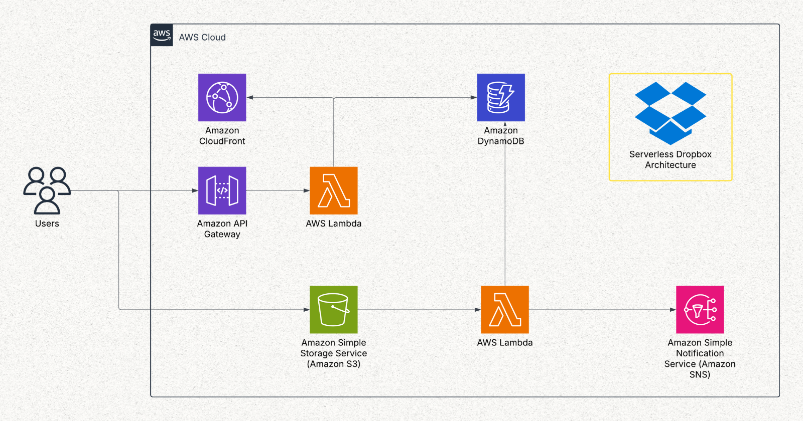

# Dropbox-Style Serverless Storage with AWS and Terraform

This project is a **Dropbox-style** file storage system built with AWS serverless services and managed as code using Terraform.
The system allows users to securely upload files and retrieve them later, with core features including:
- Secure File Uploads via Presigned URLs
- Metadata Tracking with DynamoDB
- Notification via SNS
- CDN Delivery (CloudFront)

## AWS Services Used:
- **Amazon S3**: For file storage.
- **AWS Lambda**: For serverless processing of file uploads.
- **Amazon DynamoDB**: For metadata storage.
- **Amazon SNS**: For notifications after file uploads.
- **Amazon CloudFront**: For content delivery network (CDN) capabilities.
- **AWS IAM**: For managing permissions and security.

## Terraform for Infrastructure as Code
- The infrastructure is defined using Terraform, allowing for version control and easy deployment of AWS resources.

## Secure File Uploads via Presigned URLs
- Clients obtain a time-limited presigned URL to upload files directly to Amazon S3, ensuring files never pass through insecure intermediaries. 
- This approach offloads file transfer to S3 while maintaining security by leveraging IAM permissions of the URL generator. 

## Metadata Tracking with DynamoDB
- Each file upload is logged in a DynamoDB table, storing metadata such as:
  - File name
  - Size
  - Upload timestamp
  - User ID (if applicable)
- This allows for efficient querying and management of uploaded files.
- The metadata is updated in real-time as files are uploaded, ensuring the database reflects the current state of uploads.

## Notification via SNS
- After a successful upload, an SNS notification is sent to subscribers, which can include:
  - Email notifications to users
  - Triggering other AWS services or Lambda functions for further processing
- This decouples the upload process from notification handling, allowing for scalable and flexible notification management.

## CDN Delivery (CloudFront)
- Uploaded files are served through Amazon CloudFront, providing:
  - Low-latency access to files globally
  - Caching for improved performance
  - Secure delivery with signed URLs if needed  